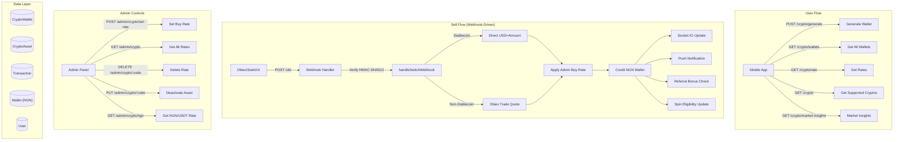

# Trade Aviator — Crypto Feature: Complete Technical Breakdown

## Table of Contents

1. [System Overview](#1-system-overview)
2. [Architecture Diagram](#2-architecture-diagram)
3. [Layer 1 — Prisma Schema (Models)](#3-layer-1--prisma-schema-models)
4. [Layer 2 — Environment Config](#4-layer-2--environment-config)
5. [Layer 3 — External API Client (Obiex/SwitchX)](#5-layer-3--external-api-client-obiexswitchx)
6. [Layer 4 — Constants & Interfaces](#6-layer-4--constants--interfaces)
7. [Layer 5 — Validation (Zod)](#7-layer-5--validation-zod)
8. [Layer 6 — DTOs (Data Transfer Objects)](#8-layer-6--dtos-data-transfer-objects)
9. [Layer 7 — Service Layer (Business Logic)](#9-layer-7--service-layer-business-logic)
10. [Layer 8 — Controller Layer](#10-layer-8--controller-layer)
11. [Layer 9 — Route Layer (User-Facing)](#11-layer-9--route-layer-user-facing)
12. [Layer 10 — Admin Controls (Rate Management)](#12-layer-10--admin-controls-rate-management)
13. [Layer 11 — Real-Time (Socket.IO Broadcasting)](#13-layer-11--real-time-socketio-broadcasting)
14. [Layer 12 — Server Wiring & Startup](#14-layer-12--server-wiring--startup)
15. [Layer 13 — Seed Data](#15-layer-13--seed-data)
16. [Shared Dependencies (Helpers & Utils)](#16-shared-dependencies-helpers--utils)
17. [Complete Sell Crypto Flow (End-to-End)](#17-complete-sell-crypto-flow-end-to-end)
18. [Buy Crypto Endpoint Blueprint](#18-buy-crypto-endpoint-blueprint)

---

## 1. System Overview

The crypto feature allows users to **sell cryptocurrency** and receive NGN (Nigerian Naira) credited to their in-app wallet. The flow is:

1. **User generates a crypto wallet** (deposit address) for a specific coin + chain combo.
2. **User sends crypto** to that address from an external wallet.
3. **Obiex (SwitchX) detects the deposit** and fires a webhook (`PENDING` → `CONFIRMED`).
4. **Backend processes the webhook**: converts crypto → USD → NGN using admin-set rates, credits the user's NGN wallet, and sends real-time + push notifications.

> [!IMPORTANT]
> There is **no user-initiated "sell" API endpoint**. The sell happens passively: user deposits crypto → webhook auto-processes → NGN credited. The system is a deposit-to-sell pipeline.

**External Provider**: [Obiex (SwitchX)](https://obiex.finance) — provides broker wallet addresses, trade quotes, and deposit webhooks.

---

## 2. Architecture Diagram



---

## 3. Layer 1 — Prisma Schema (Models)

Three models power the crypto feature:

### 3.1. `CryptoWallet` — Per-user deposit addresses

```prisma
model CryptoWallet {
  id        String   @id @default(ulid())
  userId    String
  address   String?
  createdAt DateTime @default(now())
  updatedAt DateTime @updatedAt
  provider  String?  @default("OBI")
  asset     String?                      // e.g. "BTC", "USDT", "ETH"
  chain     String?                      // e.g. "BTC", "TRX", "BSC"
  qrCode    String?                      // Base64 QR data URL
  user      User     @relation(fields: [userId], references: [id], onDelete: Cascade)

  @@unique([userId, asset, chain])       // One wallet per user+asset+chain
  @@index([userId])
  @@index([chain])
  @@index([address])
  @@map("crypto_wallets")
}
```

> [!NOTE]
> The unique constraint `[userId, asset, chain]` prevents duplicate wallet generation. If a user already has a BTC wallet on the BTC chain, it returns the existing one.

### 3.2. `CryptoAsset` — Admin-managed asset registry with buy rates

```prisma
model CryptoAsset {
  id        String   @id @default(ulid())
  code      String   @unique              // e.g. "BTC", "ETH", "USDT"
  name      String                        // e.g. "Bitcoin"
  imageUrl  String?                       // CoinGecko icon URL
  isActive  Boolean  @default(true)       // Admin toggle
  createdAt DateTime @default(now())
  updatedAt DateTime @updatedAt
  buyRate   Decimal? @db.Decimal(10, 2)   // NGN per 1 USD of this asset

  @@index([code])
  @@index([isActive])
  @@map("crypto_assets")
}
```

> [!IMPORTANT]
> `buyRate` is the NGN value per 1 USD. For a deposit of 100 USDT at buyRate=1650, the user gets ₦165,000. This rate is manually set by admin.

### 3.3. `Transaction` — Crypto-specific fields on the shared model

The existing `Transaction` model is reused. Crypto-relevant fields:

| Field              | Usage in Crypto Context                          |
| ------------------ | ------------------------------------------------ |
| `category`         | `TransactionCategory.CRYPTO`                     |
| `type`             | `TransactionType.CREDIT`                         |
| `amount`           | NGN value credited                               |
| `transactionValue` | Raw crypto amount deposited (string)              |
| `usdValue`         | USD equivalent of the deposit                    |
| `rate`             | Buy rate used (NGN/USD)                          |
| `txHash`           | Blockchain transaction hash                      |
| `currency`         | Asset code (e.g. "BTC", "USDT")                 |
| `internalRef`      | Obiex transaction ID                             |
| `externalRef`      | Obiex reference                                  |
| `reference`        | Internal ref prefixed `CRP\|`                    |

### 3.4. `User` — Crypto-relevant fields

```prisma
obiExAccountId  String?   // Unique ID passed to Obiex as broker sub-account identifier
cryptoWallets   CryptoWallet[]
```

### 3.5. `Wallet` (NGN) — Where crypto proceeds are credited

```prisma
model Wallet {
  id              String   @id @default(ulid())
  userId          String
  currency        String                         // "NGN"
  depositBalance  Decimal  @default(0) @db.Decimal(15, 2)
  ...
  @@unique([userId, currency])
}
```

### 3.6. Enums

```prisma
enum TransactionCategory {
  CRYPTO    // Used for crypto deposits
  ...
}

enum TransactionStatus {
  PENDING
  SUCCESS
  ...
}

enum TransactionType {
  CREDIT    // Crypto deposits are always CREDIT
  DEBIT
}
```

---

## 4. Layer 2 — Environment Config

File: [auth.ts](file:///Users/jay/work/TradeAviatorBackend-dev/src/shared/config/auth.ts#L73-L78)

```typescript
obiex: {
  baseUrl: getEnv("OBIEX_URL"),          // Obiex API base URL
  secretKey: getEnv("OBIEX_SECRET_KEY"), // HMAC signing secret
  publicKey: getEnv("OBIEX_PUBLIC_KEY"), // API key header
  webhookSecret: getEnv("OBIEX_WH_SECRET"), // Webhook HMAC-SHA512 key
},
```

**Required `.env` variables:**

```env
OBIEX_URL=https://api.obiex.finance/v1
OBIEX_SECRET_KEY=your_secret_key
OBIEX_PUBLIC_KEY=your_public_key
OBIEX_WH_SECRET=your_webhook_secret
```

---

## 5. Layer 3 — External API Client (Obiex/SwitchX)

### 5.1. Generic API Client

File: [apiClient.ts](file:///Users/jay/work/TradeAviatorBackend-dev/src/externals/apiClient.ts)

A thin Axios wrapper with structured error handling:

```typescript
export class ApiClient {
  static async get<T>(url, data, config, context): Promise<AxiosResponse<T>>
  static async post<T>(url, data, config, context): Promise<AxiosResponse<T>>
}
```

### 5.2. Obiex Service

File: [obiex.ts](file:///Users/jay/work/TradeAviatorBackend-dev/src/externals/crypto/obiex.ts)

```typescript
export class ObiexService {
  // HMAC-SHA256 signing: `${METHOD}/v1${path}${timestamp}`
  private static sign(method, path, timestamp): string

  // Authenticated request wrapper
  private static async request<T>(method, path, data, context): Promise<T>

  // 4 API methods used by crypto feature:
  static async getAccounts()        // GET /accounts/me
  static async getCurrencies()      // GET /currencies/networks/active
  static async createBrokerAddress(body: {
    uniqueUserIdentifier: string,   // User's obiExAccountId
    currency: string,               // e.g. "BTC"
    network: string,                // Mapped via CURRENCY_CONFIG
  })                                // POST /addresses/broker

  static async getTradeQuote(body: {
    sourceId: string,               // e.g. "BTC"
    targetId: string,               // e.g. "USDT"
    amount: number,
    side: "SELL" | "BUY",
  })                                // POST /trades/quote

  static async fetchCryptoPrices()  // CoinGecko market data
}
```

**Request signing flow:**

```
1. timestamp = Date.now()
2. content = `${METHOD}/v1${path}${timestamp}`
3. signature = HMAC-SHA256(content, secretKey)
4. Headers: X-API-KEY, X-API-TIMESTAMP, X-API-SIGNATURE
```

### 5.3. Obiex Interfaces

File: [interface.ts](file:///Users/jay/work/TradeAviatorBackend-dev/src/externals/crypto/interface.ts)

```typescript
export interface GenerateWalletBody {
  subwalletID: string;
  coin: string;
  chain: string;
}

export const COIN_GECKO_IDS = {
  BTC: "bitcoin", ETH: "ethereum", USDT: "tether",
  BCH: "bitcoin-cash", BNB: "binancecoin", LTC: "litcoin",
  POL: "polygon", XRP: "xrp", USDC: "usd-coin",
  TRX: "tron", SOL: "solana", SHIB: "shiba-inu", DOGE: "dogecoin",
};

export interface CoinGeckoResponse {
  id: string; symbol: string; name: string;
  current_price: number; price_change_percentage_24h: number;
  market_cap: number; total_volume: number; image: string;
}
```

### 5.4. Barrel Export

File: [externals/index.ts](file:///Users/jay/work/TradeAviatorBackend-dev/src/externals/index.ts)

```typescript
export * from "./crypto/obiex";
```

---

## 6. Layer 4 — Constants & Interfaces

### 6.1. Supported Currency Config

File: [constants.ts](file:///Users/jay/work/TradeAviatorBackend-dev/src/internals/crypto/constants.ts)

This maps every supported coin to its valid blockchain networks and their Obiex network codes:

```typescript
export const CURRENCY_CONFIG = {
  BCH:  { name: "Bitcoin Cash",  networks: { BCH: "BCH" } },
  BNB:  { name: "Binance Coin", networks: { ETH: "ETH", BSC: "BSC" } },
  BTC:  { name: "Bitcoin",      networks: { BSC: "BSC", BTC: "BTC" } },
  DOGE: { name: "Dogecoin",     networks: { DOGE: "DOGE", BSC: "BSC" } },
  ETH:  { name: "Ethereum",     networks: { ETH: "ETH", BASE: "BASE", ARBITRUM: "ARBITRUM", BSC: "BSC" } },
  LTC:  { name: "Litecoin",     networks: { LTC: "LTC" } },
  POL:  { name: "Polygon",      networks: { MATIC: "MATIC", ETH: "ETH", BSC: "BSC" } },
  SHIB: { name: "Shiba Inu",    networks: { BSC: "BSC", ETH: "ETH" } },
  SOL:  { name: "Solana",       networks: { BSC: "BSC", SOL: "SOL" } },
  TRX:  { name: "Tron",         networks: { TRX: "TRX" } },
  USDC: { name: "USD Coin",     networks: { ETH, BSC, SOL, BASE, MATIC, AVAXC, ARBITRUM } },
  USDT: { name: "Tether",       networks: { MATIC, TRX, SOL, ARBITRUM, BSC, AVAXC, ETH } },
} as const;

export type SupportedCoin = keyof typeof CURRENCY_CONFIG;
```

> [!TIP]
> When replicating: this config drives both validation (which coin+chain combos are valid) and the network code mapping sent to Obiex.

### 6.2. Webhook Event Interface

File: [interface.ts](file:///Users/jay/work/TradeAviatorBackend-dev/src/internals/crypto/interface.ts)

```typescript
export interface ObiexEvent {
  type: string;          // "DEPOSIT"
  currency: string;      // "BTC", "USDT", etc.
  amount: number;
  status: string;        // "PENDING" | "CONFIRMED"
  reference: string;
  transactionId: string;
  createdAt: string;
  lastUpdated: string;
  hash: string;          // Blockchain tx hash
  network: string;       // Chain name
  address: string;       // Deposit address
}
```

---

## 7. Layer 5 — Validation (Zod)

### 7.1. User Validation (Wallet Generation)

File: [crypto.validation.ts](file:///Users/jay/work/TradeAviatorBackend-dev/src/internals/crypto/crypto.validation.ts)

```typescript
import { z } from "zod";
import { CURRENCY_CONFIG } from "./constants";

const SUPPORTED_ASSETS = Object.keys(CURRENCY_CONFIG) as [string, ...string[]];

const generateCryptoPairSchema = z
  .object({
    coin: z.enum(SUPPORTED_ASSETS, { message: "Asset is required." }),
    chain: z.string({ message: "Chain is required." }),
  })
  .refine(
    (data) => {
      const coinConfig = CURRENCY_CONFIG[data.coin as keyof typeof CURRENCY_CONFIG];
      if (!coinConfig) return false;
      return Object.keys(coinConfig.networks).includes(data.chain);
    },
    { message: "Invalid chain for the selected asset", path: ["chain"] },
  );

export const walletValidation = { generateCryptoPairSchema };
```

**Validation logic**: Ensures `coin` is in `CURRENCY_CONFIG`, then checks that `chain` is a valid network key for that specific coin.

### 7.2. Admin Validation (Rate Setting)

File: [cryptorate.validation.ts](file:///Users/jay/work/TradeAviatorBackend-dev/src/admins/validations/cryptorate.validation.ts)

```typescript
import { z } from "zod";

export const SUPPORTED_COINS = [
  "BTC", "USDT", "BNB", "ETH", "USDC", "LTC",
  "BCH", "DOGE", "SOL", "POL", "SHIB", "TRX", "MATIC",
] as const;

const setRateSchema = z.object({
  valueNGN: z.number({ message: "NGN value is required" }).positive(),
  baseAsset: z.enum(SUPPORTED_COINS, {
    message: `Coin name is required and must be one of: ${SUPPORTED_COINS.join(", ")}`,
  }),
});

export const rateValidation = { setRateSchema };
```

---

## 8. Layer 6 — DTOs (Data Transfer Objects)

File: [crypto.dtos.ts](file:///Users/jay/work/TradeAviatorBackend-dev/src/internals/crypto/crypto.dtos.ts)

### 8.1. `WalletResponseDTO` — Single wallet response

```typescript
export class WalletResponseDTO {
  id: string;
  asset: string;
  chain: string;
  address: string;
  qrCode: string;

  constructor(wallet: any) {
    this.id = wallet.id;
    this.asset = wallet.asset;
    this.chain = wallet.chain;
    this.address = wallet.address;
    this.qrCode = wallet.qrCode;
  }
}
```

### 8.2. `GetWalletsDTO` — Wallet list with rates

```typescript
export class GetWalletsDTO {
  id: string; userId: string; asset: string;
  chain: string; address: string; qrCode?: string | null;
  rate: number;  // Buy rate injected from CryptoAsset

  constructor(wallet: any, rate: number = 0) { /* ... */ }

  static fromArray(wallets: any[], ratesMap: Record<string, number>): GetWalletsDTO[] {
    return wallets.map(w => new GetWalletsDTO(w, ratesMap[w.asset] || 0));
  }
}
```

### 8.3. `ObiexCurrencyDTO` — Supported crypto with network priority

```typescript
export class ObiexCurrencyDTO {
  symbol: string;
  currencyName: string;
  networks: ObiexNetworkDTO[];
  image?: string;

  // Networks are sorted by priority (e.g., BTC: native first, BSC second)
  // USDT: TRX first, ETH second, BSC third
}
```

### 8.4. `MarketInsightDTO` — CoinGecko data

```typescript
export class MarketInsightDTO {
  symbol: string; name: string; image: string;
  currentPrice: number; priceChange24h: number; marketCap: number;
}
```

### 8.5. Admin DTOs

File: [cryptorate.dto.ts](file:///Users/jay/work/TradeAviatorBackend-dev/src/admins/dtos/cryptorate.dto.ts)

```typescript
export class CryptoRateResponseDto {
  message: string;
  rate: any;
}

export class CryptoAssetResponseDto {
  message: string;
  asset: any;
}
```

---

## 9. Layer 7 — Service Layer (Business Logic)

File: [crypto.service.ts](file:///Users/jay/work/TradeAviatorBackend-dev/src/internals/crypto/crypto.service.ts)

This is the core of the sell flow. There is **one exported function**: `handleSwitchWebhook`.

### 9.1. `handleSwitchWebhook(event: ObiexEvent)` — Full Breakdown

**Step 1 — Normalize & Validate**

```typescript
const normalizedChain = event.network.toUpperCase();
const normalizedAsset = event.currency.toUpperCase();
const depositAmount = Number(event.amount);

if (isNaN(depositAmount) || depositAmount <= 0) {
  return { success: false, message: "Invalid amount" };
}
```

**Step 2 — Find Wallet by Address + Chain + Asset**

```typescript
const cryptoWallet = await prisma.cryptoWallet.findFirst({
  where: {
    address: { equals: event.address, mode: "insensitive" },
    chain: { equals: normalizedChain, mode: "insensitive" },
    asset: normalizedAsset,
  },
});
// If not found → Unknown address, reject
```

**Step 3 — Deduplication Check**

```typescript
const existingTx = await prisma.transaction.findFirst({
  where: { txHash: event.hash },
});

if (existingTx?.status === TransactionStatus.SUCCESS) {
  return { success: true, message: "Already processed" };
}
if (existingTx?.status === TransactionStatus.PENDING && event.status === "PENDING") {
  return { success: true, message: "Already recorded as pending" };
}
```

**Step 4 — Get Admin-Set Buy Rate**

```typescript
const cryptoRate = await prisma.cryptoAsset.findFirst({
  where: { code: normalizedAsset, isActive: true },
  orderBy: { updatedAt: "desc" },
});
const coinBuyRate = Number(cryptoRate.buyRate); // NGN per 1 USD
```

**Step 5 — USD Conversion**

```typescript
// Stablecoins (USDT, USDC, BUSD): 1 coin = 1 USD
if (isStableCoin) {
  usdValue = Math.round(depositAmount * 100) / 100;
  ngnValue = Math.round(usdValue * coinBuyRate * 100) / 100;
}

// Non-stablecoins (BTC, ETH, etc.): Get USD via Obiex quote
else {
  const quoteResponse = await ObiexService.getTradeQuote({
    sourceId: normalizedAsset,
    targetId: "USDT",
    amount: depositAmount,
    side: "SELL",
  });
  usdValue = Math.round(Number(quoteResponse.data.amountReceived) * 100) / 100;
  ngnValue = Math.round(usdValue * coinBuyRate * 100) / 100;
}
```

**Step 6a — Handle PENDING status**

```typescript
if (event.status === "PENDING") {
  // Create PENDING transaction
  await prisma.transaction.create({
    data: {
      userId: cryptoWallet.userId,
      category: TransactionCategory.CRYPTO,
      type: TransactionType.CREDIT,
      amount: ngnValue,
      transactionValue: depositAmount.toString(),
      usdValue: usdValue.toFixed(2),
      rate: coinBuyRate.toFixed(2),
      currency: normalizedAsset,
      txHash: event.hash,
      status: TransactionStatus.PENDING,
      reference: `CRP|${generateTransactionReference()}`,
      narration: `Crypto Deposit (${normalizedAsset}) - Pending`,
      // ...other fields
    },
  });

  // Queue push notification: "Incoming deposit detected"
  await publishToQueue({ type: "NOTIFICATION_EVENT", payload: { ... } });
  return { success: true };
}
```

**Step 6b — Handle CONFIRMED status (Atomic Transaction)**

```typescript
const [transaction, updatedWallet] = await prisma.$transaction([
  // Either update existing PENDING → SUCCESS, or create new SUCCESS
  existingTx?.status === TransactionStatus.PENDING
    ? prisma.transaction.update({
        where: { id: existingTx.id },
        data: { status: TransactionStatus.SUCCESS, narration: "...confirmed" },
      })
    : prisma.transaction.create({ data: { ...fullData, status: TransactionStatus.SUCCESS } }),

  // Credit NGN wallet
  prisma.wallet.update({
    where: { userId_currency: { userId: cryptoWallet.userId, currency: "NGN" } },
    data: { depositBalance: { increment: ngnValue } },
  }),
]);
```

**Step 7 — Post-Credit Side Effects (fire-and-forget via `setImmediate`)**

```typescript
// 1. Real-time balance update via Socket.IO
emitVirtualWalletUpdate(cryptoWallet.userId, updatedWallet.depositBalance.toString(), ...);

// 2. Push notification: "Deposit confirmed, ₦X credited"
await publishToQueue({ type: "NOTIFICATION_EVENT", payload: { ... } });

// 3. Referral bonus: if user was referred + KYC verified + USD >= minimum
if (user.referredById && user.isKycVerified && usdValue >= MIN_REFERRAL_TRANSACTION_USD) {
  // Find pending SIGNUP earning → mark CONFIRMED → credit referrer's referralBalance
}

// 4. Spin eligibility update
await spinService.updateSpinEligibility(cryptoWallet.userId, usdValue);
```

---

## 10. Layer 8 — Controller Layer

File: [crypto.controller.ts](file:///Users/jay/work/TradeAviatorBackend-dev/src/internals/crypto/crypto.controller.ts)

### 10.1. `generateCryptoWallet`

```
POST /api/v1/crypto/generate
Body: { coin: "BTC", chain: "BTC" }
Auth: requireAuth
```

Flow:
1. Parse + validate via `walletValidation.generateCryptoPairSchema`
2. Check `prisma.cryptoWallet.findUnique({ userId_asset_chain })` for existing wallet
3. If exists → return it (idempotent)
4. Get user's `obiExAccountId`
5. Map chain to Obiex network code via `CURRENCY_CONFIG`
6. Call `ObiexService.createBrokerAddress({ uniqueUserIdentifier, currency, network })`
7. Generate QR code from address via `generateCryptoQRCode(address)`
8. Create `CryptoWallet` in DB
9. Return `WalletResponseDTO`

### 10.2. `getAllUserWallet`

```
GET /api/v1/crypto/wallets
Auth: requireAuth
```

Fetches all `CryptoWallet` for user, enriches with buy rates from `CryptoAsset`, returns via `GetWalletsDTO.fromArray()`.

### 10.3. `getCoinRate`

```
GET /api/v1/crypto/rate
Auth: requireAuth
```

Returns all active `CryptoAsset` with non-null `buyRate`.

### 10.4. `getCryptos`

```
GET /api/v1/crypto
Auth: requireAuth
```

Fetches supported currencies from Obiex (`ObiexService.getCurrencies()`), filters to only `isActive` assets from DB, merges image URLs from `CryptoAsset.imageUrl`.

### 10.5. `getMarketInsights`

```
GET /api/v1/crypto/market-insights
Auth: none (commented out)
```

Fetches CoinGecko market data via `ObiexService.fetchCryptoPrices()`, returns via `MarketInsightDTO.fromArray()`.

### 10.6. `webhookHandler`

```
POST /obi (mounted at server root, NOT under /api/v1)
Auth: HMAC-SHA512 signature verification
```

Flow:
1. Get `x-obiex-signature` header
2. Get `rawBody` (captured via `express.json({ verify })`)
3. Compute `HMAC-SHA512(rawBody, webhookSecret)`
4. Compare signatures → reject if mismatch
5. Validate event type is `DEPOSIT` and status is `PENDING` or `CONFIRMED`
6. Validate `address` and `network` are present
7. Delegate to `handleSwitchWebhook(event)`

> [!WARNING]
> The `rawBody` is critical for webhook signature verification. It's captured in `server.ts` via `express.json({ verify: (req, _res, buf) => { req.rawBody = buf.toString(); } })`. Without this, signature verification will always fail.

---

## 11. Layer 9 — Route Layer (User-Facing)

File: [crypto.route.ts](file:///Users/jay/work/TradeAviatorBackend-dev/src/internals/crypto/crypto.route.ts)

```typescript
const cryptoRoutes = express.Router();

cryptoRoutes.post("/generate", requireAuth, validate(walletValidation.generateCryptoPairSchema), cryptoWalletController.generateCryptoWallet);
cryptoRoutes.get("/rate", requireAuth, cryptoWalletController.getCoinRate);
cryptoRoutes.get("/wallets", requireAuth, cryptoWalletController.getAllUserWallet);
cryptoRoutes.get("/", requireAuth, cryptoWalletController.getCryptos);
cryptoRoutes.get("/market-insights", cryptoWalletController.getMarketInsights);

export { cryptoRoutes };
```

**Mounted at**: `/api/v1/crypto` (via [base.route.ts](file:///Users/jay/work/TradeAviatorBackend-dev/src/routes/base.route.ts#L42))

### Route Summary Table

| Method | Path                             | Auth       | Handler                |
| ------ | -------------------------------- | ---------- | ---------------------- |
| POST   | `/api/v1/crypto/generate`        | `requireAuth` | `generateCryptoWallet` |
| GET    | `/api/v1/crypto/rate`            | `requireAuth` | `getCoinRate`          |
| GET    | `/api/v1/crypto/wallets`         | `requireAuth` | `getAllUserWallet`     |
| GET    | `/api/v1/crypto`                 | `requireAuth` | `getCryptos`           |
| GET    | `/api/v1/crypto/market-insights` | none       | `getMarketInsights`    |
| POST   | `/obi`                           | HMAC-SHA512 | `webhookHandler`       |

---

## 12. Layer 10 — Admin Controls (Rate Management)

### 12.1. Admin Controller

File: [cryptorates.controller.ts](file:///Users/jay/work/TradeAviatorBackend-dev/src/admins/controllers/cryptorates.controller.ts)

| Function            | Purpose                                                           |
| ------------------- | ----------------------------------------------------------------- |
| `setPairRate`       | Update `CryptoAsset.buyRate` + emit `crypto:rate-updated` via Socket.IO |
| `getAllRates`       | List all active `CryptoAsset` records                              |
| `updateCryptoAsset` | Set `isActive: false` to deactivate an asset                       |
| `deleteRate`        | Set `buyRate: null` to remove rate (asset stays but can't be sold) |
| `getNGNRate`        | Get live USDT→NGNX rate from Obiex quote API                      |

### 12.2. Admin Routes

File: [cryptorate.route.ts](file:///Users/jay/work/TradeAviatorBackend-dev/src/admins/routes/cryptorate.route.ts)

```typescript
cryptoRoutes.post("/set-rate", requireAdminAuth, requireAdmin, validate(setRateSchema), cryptoController.setPairRate);
cryptoRoutes.get("/", requireAdminAuth, requireAdmin, cryptoController.getAllRates);
cryptoRoutes.get("/ngn", requireAdminAuth, requireAdmin, cryptoController.getNGNRate);
cryptoRoutes.delete("/:code", requireAdminAuth, requireAdmin, cryptoController.deleteRate);
cryptoRoutes.put("/:code", requireAdminAuth, requireAdmin, cryptoController.updateCryptoAsset);
```

**Mounted at**: `/api/v1/admin/crypto` (via [admin.route.ts](file:///Users/jay/work/TradeAviatorBackend-dev/src/routes/admin.route.ts#L29))

### Admin Route Summary Table

| Method | Path                         | Middleware                        | Handler             |
| ------ | ---------------------------- | --------------------------------- | ------------------- |
| POST   | `/api/v1/admin/crypto/set-rate` | `requireAdminAuth` + `requireAdmin` | `setPairRate`       |
| GET    | `/api/v1/admin/crypto`       | `requireAdminAuth` + `requireAdmin` | `getAllRates`       |
| GET    | `/api/v1/admin/crypto/ngn`   | `requireAdminAuth` + `requireAdmin` | `getNGNRate`        |
| DELETE | `/api/v1/admin/crypto/:code` | `requireAdminAuth` + `requireAdmin` | `deleteRate`        |
| PUT    | `/api/v1/admin/crypto/:code` | `requireAdminAuth` + `requireAdmin` | `updateCryptoAsset` |

---

## 13. Layer 11 — Real-Time (Socket.IO Broadcasting)

### 13.1. Crypto Rate Broadcasting

File: [crypto.socket.ts](file:///Users/jay/work/TradeAviatorBackend-dev/src/internals/crypto/crypto.socket.ts)

```typescript
// Broadcasts all active crypto rates every 5 minutes to all connected clients
const BROADCAST_INTERVAL_MS = 5 * 60 * 1000;

export const startCryptoRateBroadcasting = () => {
  broadcastRates();  // Initial broadcast
  setInterval(broadcastRates, BROADCAST_INTERVAL_MS);
};

const broadcastRates = async () => {
  const rates = await prisma.cryptoAsset.findMany({
    where: { isActive: true, buyRate: { not: null } },
  });
  io.emit("crypto:rates", { message: "Live crypto rates update", rates });
};
```

**Socket events emitted:**

| Event                    | Trigger                      | Payload                         |
| ------------------------ | ---------------------------- | ------------------------------- |
| `crypto:rates`           | Every 5 min (broadcast)      | All active rates                |
| `crypto:rate-updated`    | Admin sets new rate          | Single asset rate update        |
| `wallet:balance:updated` | Crypto deposit confirmed     | New balance + transaction info  |

### 13.2. Wallet Balance Updates

File: [wallet.socket.ts](file:///Users/jay/work/TradeAviatorBackend-dev/src/internals/wallets/wallet.socket.ts)

After a crypto deposit credits the NGN wallet:

```typescript
emitVirtualWalletUpdate(userId, newBalance, previousBalance, {
  id: transactionId,
  type: TransactionType.CREDIT,
  amount: ngnValue,
  reference: txReference,
});
// Emits: "wallet:balance:updated" → user-specific room
```

---

## 14. Layer 12 — Server Wiring & Startup

### 14.1. Server.ts — Webhook Mount

File: [server.ts](file:///Users/jay/work/TradeAviatorBackend-dev/src/server.ts#L185)

```typescript
// Webhook is mounted at ROOT level, NOT under /api/v1
app.use("/obi", cryptoWalletController.webhookHandler);
```

Also critical — raw body capture:

```typescript
app.use(express.json({
  limit: "10kb",
  verify: (req: any, _res, buf) => {
    req.rawBody = buf.toString();  // Needed for webhook signature verification
  },
}));
```

Content-type validation bypass for webhooks:

```typescript
app.use((req, res, next) => {
  if (req.path.startsWith("/webhook/")) return next();
  // ... content-type checks
});
```

### 14.2. Server Startup — www.ts

File: [www.ts](file:///Users/jay/work/TradeAviatorBackend-dev/src/bin/www.ts#L40)

```typescript
// Start crypto rate broadcasting on server boot
startCryptoRateBroadcasting();

// Stop on graceful shutdown
stopCryptoRateBroadcasting();
```

---

## 15. Layer 13 — Seed Data

File: [crypto.seed.ts](file:///Users/jay/work/TradeAviatorBackend-dev/prisma/crypto.seed.ts)

Seeds the `CryptoAsset` table with supported coins:

```typescript
const CRYPTO_ASSETS_DATA = [
  { code: "BCH",  name: "Bitcoin Cash",  image: "https://assets.coingecko.com/..." },
  { code: "BNB",  name: "Binance Coin", image: "..." },
  { code: "BTC",  name: "Bitcoin",      image: "..." },
  { code: "DOGE", name: "Dogecoin",     image: "..." },
  { code: "ETH",  name: "Ethereum",     image: "..." },
  { code: "LTC",  name: "Litecoin",     image: "..." },
  { code: "MATIC",name: "Polygon",      image: "..." },
  { code: "POL",  name: "Polygon",      image: "..." },
  { code: "SHIB", name: "Shiba Inu",    image: "..." },
  { code: "SOL",  name: "Solana",       image: "..." },
  { code: "TRX",  name: "Tron",         image: "..." },
  { code: "USDC", name: "USD Coin",     image: "..." },
  { code: "USDT", name: "Tether",       image: "..." },
];

// Upserts all + deletes any not in the list
export async function seedCryptoAssets() {
  await prisma.cryptoAsset.deleteMany({ where: { code: { notIn: activeCodes } } });
  for (const asset of CRYPTO_ASSETS_DATA) {
    await prisma.cryptoAsset.upsert({ where: { code: asset.code }, update: {...}, create: {...} });
  }
}
```

> [!TIP]
> Run the seed: `pnpm exec ts-node prisma/crypto.seed.ts`. This is also called from the main `prisma/seed.ts`.

---

## 16. Shared Dependencies (Helpers & Utils)

### 16.1. QR Code Generation

File: [barcode.ts](file:///Users/jay/work/TradeAviatorBackend-dev/src/shared/helpers/barcode.ts)

```typescript
import QRCode from "qrcode";

export async function generateCryptoQRCode(address: string): Promise<string> {
  return await QRCode.toDataURL(address, { width: 300, margin: 1 });
  // Returns base64 data URL
}
```

**Dependency**: `qrcode` npm package.

### 16.2. Reference Generation

File: [references.ts](file:///Users/jay/work/TradeAviatorBackend-dev/src/shared/helpers/references.ts)

```typescript
export function generateTransactionReference(): string {
  // Format: YYYYMMDD + base36(timestamp) + 4-digit random
  // Example: "20260618M2K3X47891"
}

export function generateSessionId(): string {
  // timestamp + 13-digit random
}
```

### 16.3. Account ID Generation (for Obiex)

File: [accountid.ts](file:///Users/jay/work/TradeAviatorBackend-dev/src/shared/helpers/accountid.ts)

```typescript
export function generateAccountID(): string {
  // 10-char random lowercase string
  // Stored as user.obiExAccountId, passed to Obiex as uniqueUserIdentifier
}
```

> [!IMPORTANT]
> This ID is generated during user registration and stored as `obiExAccountId` on the `User` model. It acts as the broker sub-account identifier for Obiex. **Every user must have one** before they can generate crypto wallets.

---

## 17. Complete Sell Crypto Flow (End-to-End)

```mermaid
sequenceDiagram
    participant U as User (Mobile)
    participant B as Backend
    participant O as Obiex API
    participant BC as Blockchain

    Note over U,B: Step 1: Wallet Generation
    U->>B: POST /api/v1/crypto/generate {coin: "BTC", chain: "BTC"}
    B->>B: Validate coin+chain via CURRENCY_CONFIG
    B->>B: Check for existing CryptoWallet
    B->>O: POST /addresses/broker {uniqueUserIdentifier, currency, network}
    O-->>B: { data: { value: "bc1q..." } }
    B->>B: Generate QR code
    B->>B: Save CryptoWallet to DB
    B-->>U: { wallet: { address: "bc1q...", qrCode: "data:image/png;..." } }

    Note over U,BC: Step 2: User Deposits
    U->>BC: Send 0.001 BTC to bc1q...

    Note over O,B: Step 3: Webhook PENDING
    BC->>O: Deposit detected (unconfirmed)
    O->>B: POST /obi {type:"DEPOSIT", status:"PENDING", hash:"abc...", amount:0.001}
    B->>B: Verify HMAC-SHA512 signature
    B->>B: Find CryptoWallet by address+chain
    B->>B: Check tx deduplication by hash
    B->>B: Get buyRate from CryptoAsset
    B->>O: POST /trades/quote {BTC→USDT, 0.001, SELL}
    O-->>B: { amountReceived: 105.50 }
    B->>B: USD=105.50, NGN=105.50×1650=174,075
    B->>B: Create PENDING Transaction
    B->>U: Push: "Incoming deposit detected"

    Note over O,B: Step 4: Webhook CONFIRMED
    BC->>O: Deposit confirmed
    O->>B: POST /obi {type:"DEPOSIT", status:"CONFIRMED", hash:"abc...", amount:0.001}
    B->>B: Verify signature
    B->>B: Find existing PENDING tx by hash
    B->>B: Atomic: Update tx→SUCCESS + Credit NGN wallet
    B->>U: Socket: wallet:balance:updated {balance: 174,075}
    B->>U: Push: "₦174,075 credited to your wallet"
    B->>B: Check referral bonus eligibility
    B->>B: Update spin eligibility
```

---

## 18. Buy Crypto Endpoint Blueprint

The current system only supports **sell** (deposit crypto → receive NGN). Below is the architecture for adding a **buy** endpoint where users spend NGN to purchase crypto.

### 18.1. Data Flow

```
User submits buy request → Debit NGN wallet → Get Obiex trade quote →
Execute trade via Obiex → Record transaction → Notify user
```

### 18.2. What Needs to Change

#### Schema Changes

Add a `sellRate` field to `CryptoAsset`:

```prisma
model CryptoAsset {
  // ... existing fields
  buyRate   Decimal? @db.Decimal(10, 2)   // existing: NGN per 1 USD (for sell/deposit)
  sellRate  Decimal? @db.Decimal(10, 2)   // NEW: NGN per 1 USD (for buy/withdrawal)
}
```

> [!IMPORTANT]
> `buyRate` = what the platform pays the user (user sells crypto).
> `sellRate` = what the user pays the platform (user buys crypto).
> `sellRate` should always be higher than `buyRate` — that's the platform's spread/margin.

#### Obiex Side

You'll need Obiex's **trade execution** or **withdrawal** API (beyond just quotes). Check their docs for:
- `POST /trades/execute` — Execute a quoted trade
- `POST /withdrawals` — Send crypto to an external address

---

### 18.3. New Files to Create

#### A. Validation — `crypto.validation.ts` (extend existing)

```typescript
const buyCryptoSchema = z.object({
  coin: z.enum(SUPPORTED_ASSETS, { message: "Asset is required." }),
  chain: z.string({ message: "Chain is required." }),
  amountNGN: z.number().positive({ message: "Amount must be positive" }),
  destinationAddress: z.string().min(10, { message: "Valid wallet address required" }),
}).refine(
  (data) => {
    const coinConfig = CURRENCY_CONFIG[data.coin as keyof typeof CURRENCY_CONFIG];
    if (!coinConfig) return false;
    return Object.keys(coinConfig.networks).includes(data.chain);
  },
  { message: "Invalid chain for the selected asset", path: ["chain"] },
);

export const walletValidation = {
  generateCryptoPairSchema,
  buyCryptoSchema,          // NEW
};
```

#### B. Service — `crypto.service.ts` (add new function)

```typescript
export async function processBuyCrypto(params: {
  userId: string;
  coin: string;
  chain: string;
  amountNGN: number;
  destinationAddress: string;
}) {
  const { userId, coin, chain, amountNGN, destinationAddress } = params;

  // 1. Get sell rate
  const cryptoAsset = await prisma.cryptoAsset.findFirst({
    where: { code: coin, isActive: true },
  });

  if (!cryptoAsset?.sellRate) {
    throw new BadRequestException(`Buy rate not available for ${coin}`);
  }

  const sellRate = Number(cryptoAsset.sellRate); // NGN per 1 USD
  const usdValue = Math.round((amountNGN / sellRate) * 100) / 100;

  // 2. Get crypto amount via Obiex quote
  const isStableCoin = ["USDT", "USDC", "BUSD"].includes(coin);
  let cryptoAmount: number;

  if (isStableCoin) {
    cryptoAmount = usdValue; // 1:1
  } else {
    const quote = await ObiexService.getTradeQuote({
      sourceId: "USDT",
      targetId: coin,
      amount: usdValue,
      side: "BUY",
    });
    cryptoAmount = Number(quote.data.amountReceived);
    if (cryptoAmount <= 0) {
      throw new BadRequestException("Could not get conversion quote");
    }
  }

  // 3. Debit NGN wallet (atomically)
  const transactionRef = `CRP-BUY|${generateTransactionReference()}`;
  const sessionId = generateSessionId();

  const result = await prisma.$transaction(async (tx) => {
    // Debit wallet
    const wallet = await tx.wallet.findUnique({
      where: { userId_currency: { userId, currency: "NGN" } },
    });
    if (!wallet) throw new NotFoundException("Wallet not found");

    const balance = new Prisma.Decimal(wallet.depositBalance);
    if (balance.lt(amountNGN)) {
      throw new BadRequestException("Insufficient balance");
    }

    const updatedWallet = await tx.wallet.update({
      where: { userId_currency: { userId, currency: "NGN" } },
      data: { depositBalance: { decrement: amountNGN } },
    });

    // Create transaction record
    const transaction = await tx.transaction.create({
      data: {
        userId,
        walletId: wallet.id,
        category: TransactionCategory.CRYPTO,
        type: TransactionType.DEBIT,
        amount: amountNGN,
        transactionValue: cryptoAmount.toString(),
        usdValue: usdValue.toFixed(2),
        rate: sellRate.toFixed(2),
        reference: transactionRef,
        sessionId,
        currency: coin,
        provider: "Trade Aviator",
        channel: "wallet",
        narration: `Crypto Purchase (${coin}) - Processing`,
        status: TransactionStatus.PROCESSING,
        recipient: destinationAddress,
      },
    });

    return { updatedWallet, transaction };
  });

  // 4. Execute Obiex withdrawal (fire-and-forget or await)
  // This depends on Obiex's withdrawal/trade API
  try {
    // Option A: If Obiex has a withdrawal API
    // await ObiexService.createWithdrawal({
    //   currency: coin,
    //   network: CURRENCY_CONFIG[coin].networks[chain],
    //   amount: cryptoAmount,
    //   address: destinationAddress,
    // });

    // Option B: If Obiex has a trade+send API
    // await ObiexService.executeTrade({ ... });

    // Update transaction to SUCCESS
    await prisma.transaction.update({
      where: { id: result.transaction.id },
      data: { status: TransactionStatus.SUCCESS, narration: `Crypto Purchase (${coin})` },
    });
  } catch (error) {
    // Refund on failure
    await refundWallet(userId, result.updatedWallet.id, amountNGN, "NGN", transactionRef, "Crypto purchase failed");
    await prisma.transaction.update({
      where: { id: result.transaction.id },
      data: { status: TransactionStatus.FAILED, narration: `Crypto Purchase Failed (${coin})` },
    });
    throw new InternalServerErrorException("Crypto purchase failed. Amount refunded.");
  }

  // 5. Emit socket update
  emitVirtualWalletUpdate(userId, result.updatedWallet.depositBalance.toString(), undefined, {
    id: result.transaction.id,
    type: TransactionType.DEBIT,
    amount: amountNGN.toString(),
    reference: transactionRef,
  });

  // 6. Push notification
  await publishToQueue({
    type: "NOTIFICATION_EVENT",
    payload: {
      userId,
      notificationType: "TRANSACTION",
      priority: "high",
      title: "Crypto Purchase Successful",
      message: `You purchased ${cryptoAmount} ${coin} for ₦${amountNGN.toLocaleString()}. It has been sent to ${destinationAddress.slice(0, 8)}...`,
      deliveryChannels: ["push", "in_app"],
    },
  });

  return {
    transaction: result.transaction,
    cryptoAmount,
    usdValue,
    destinationAddress,
  };
}
```

#### C. Controller — `crypto.controller.ts` (add new handler)

```typescript
const buyCrypto = Asyncly(async (req: Request, res: Response) => {
  const userId = req.currentUser.id;
  const data = walletValidation.buyCryptoSchema.parse(req.body);

  if (!userId) {
    throw new UnauthorizedException("Authentication required");
  }

  const result = await processBuyCrypto({
    userId,
    coin: data.coin,
    chain: data.chain,
    amountNGN: data.amountNGN,
    destinationAddress: data.destinationAddress,
  });

  return res.status(httpStatus.OK).json({
    message: "Crypto purchase successful",
    data: {
      transactionId: result.transaction.id,
      reference: result.transaction.reference,
      cryptoAmount: result.cryptoAmount,
      coin: data.coin,
      chain: data.chain,
      ngnSpent: data.amountNGN,
      usdValue: result.usdValue,
      destinationAddress: data.destinationAddress,
    },
  });
});

// Export
export const cryptoWalletController = {
  generateCryptoWallet,
  getAllUserWallet,
  getCoinRate,
  getCryptos,
  getMarketInsights,
  webhookHandler,
  buyCrypto,           // NEW
};
```

#### D. Route — `crypto.route.ts` (add new route)

```typescript
cryptoRoutes.post(
  "/buy",
  requireAuth,
  validate(walletValidation.buyCryptoSchema),
  cryptoWalletController.buyCrypto,
);
```

#### E. Admin — Add sell rate management

In [cryptorates.controller.ts](file:///Users/jay/work/TradeAviatorBackend-dev/src/admins/controllers/cryptorates.controller.ts), add:

```typescript
const setSellRate = Asyncly(async (req, res) => {
  const data = rateValidation.setSellRateSchema.parse(req.body);

  const asset = await prisma.cryptoAsset.update({
    where: { code: data.baseAsset },
    data: { sellRate: data.valueNGN },
  });

  emitToAll("crypto:sell-rate-updated", {
    baseAsset: asset.code,
    sellRate: asset.sellRate,
    updatedAt: new Date().toISOString(),
  });

  res.status(httpStatus.OK).json({
    message: "Sell rate updated successfully",
    rate: asset,
  });
});
```

Add validation:

```typescript
const setSellRateSchema = z.object({
  valueNGN: z.number().positive(),
  baseAsset: z.enum(SUPPORTED_COINS),
});
```

Add route:

```typescript
cryptoRoutes.post("/set-sell-rate", requireAdminAuth, requireAdmin, validate(setSellRateSchema), cryptoController.setSellRate);
```

---

### 18.4. Checklist for Replication

> [!IMPORTANT]
> Follow this order exactly. Each step depends on the previous.

- [ ] **Prisma schema**: Add `CryptoWallet`, `CryptoAsset` models. Add `CRYPTO` to `TransactionCategory` enum. Add `obiExAccountId` to `User`. Add `txHash`, `usdValue`, `rate`, `transactionValue` to `Transaction`.
- [ ] **Run migration**: `pnpm exec prisma migrate dev --name add_crypto_models`
- [ ] **Environment**: Add `OBIEX_URL`, `OBIEX_SECRET_KEY`, `OBIEX_PUBLIC_KEY`, `OBIEX_WH_SECRET` to config.
- [ ] **External API client**: Create `ApiClient` class + `ObiexService` class with signing.
- [ ] **Constants**: Create `CURRENCY_CONFIG` with coin→network mappings.
- [ ] **Interfaces**: Create `ObiexEvent` interface.
- [ ] **Validations**: Create `generateCryptoPairSchema` (Zod) + admin `setRateSchema`.
- [ ] **DTOs**: Create `WalletResponseDTO`, `GetWalletsDTO`, `ObiexCurrencyDTO`, `MarketInsightDTO`.
- [ ] **Helpers**: Add `generateCryptoQRCode`, `generateAccountID` (set during registration).
- [ ] **Service**: Implement `handleSwitchWebhook` with full deposit processing.
- [ ] **Controller**: Implement all 6 handlers.
- [ ] **Routes (user)**: Mount under `/api/v1/crypto`.
- [ ] **Routes (webhook)**: Mount at `/obi` on server root with raw body capture.
- [ ] **Admin controller + routes**: Rate CRUD under `/api/v1/admin/crypto`.
- [ ] **Socket.IO**: Add `startCryptoRateBroadcasting` + `emitVirtualWalletUpdate`.
- [ ] **Seed**: Create and run `crypto.seed.ts`.
- [ ] **Startup**: Wire `startCryptoRateBroadcasting()` in `www.ts`.
- [ ] **(Optional) Buy endpoint**: Follow Section 18 blueprint.

---

### 18.5. NPM Dependencies Required

```json
{
  "qrcode": "^1.5.x",
  "axios": "^1.x.x",
  "zod": "^3.x.x",
  "socket.io": "^4.x.x"
}
```

> [!CAUTION]
> The buy endpoint involves real money movement. Before going live:
> 1. Implement idempotency (prevent double-buys via `idempotencyKey`)
> 2. Add rate locking (quote should be valid for X seconds, not fetched at execution time)
> 3. Add withdrawal address whitelisting
> 4. Add daily/per-transaction buy limits based on user tier
> 5. Add admin approval flow for large purchases
